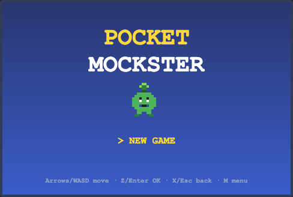
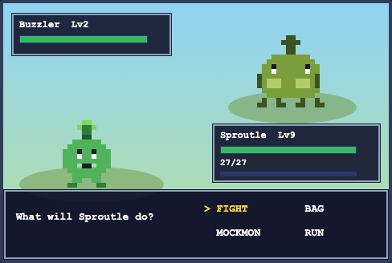
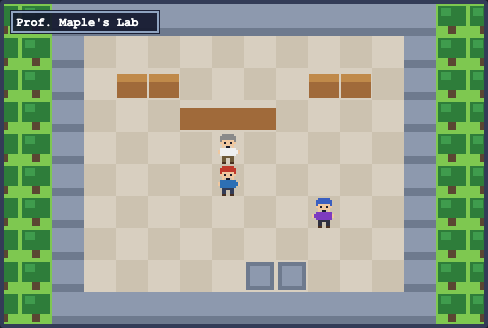

# Pocket Mockster

A monster-catching RPG built from scratch in TypeScript + HTML5 canvas. Original creatures, original pixel art, classic mechanics: explore, battle, catch, train, and take on the first gym.

| Title | Battle | Lab | City |
|---|---|---|---|
|  |  |  |  |

## Play

```bash
npm install
npm run dev
```

Open http://localhost:5173.

**Controls**: Arrow keys / WASD to move · Z or Enter to confirm/interact · X or Esc to cancel · M or Shift for the menu.

## The demo story (up to the first gym)

1. Pick a starter from Prof. Maple in her lab: Sproutle (Grass), Cindercub (Fire), or Puddlefin (Water)
2. Beat your rival Kai, who always picks the type that counters you
3. Get MockBalls from the old man in Maple Town
4. Cross Route 1: tall-grass wild encounters, item pickups, and three trainers who spot you on sight
5. In Verdant City: heal at the Mock Center, shop at the Mock Mart
6. Beat Gym Trainer Rocco, then Leader Terra (Rock-type) to earn the Boulder Badge

## Mechanics

- 20 original Mockemon with hand-made 16x16 pixel sprites, base stats, learnsets, and MockDex entries
- 10-type effectiveness chart, physical/special split, STAB, crits, stat stages, priority moves
- Classic damage formula, IVs, cubic EXP curve, level-up move learning, and evolutions (Lv15+)
- Status conditions: burn, poison, paralysis, sleep
- Catch mechanics based on HP, species catch rate, and status bonuses
- Trainer line-of-sight battles, prize money, whiteout-to-heal-point on defeat
- Bag, party management, shop economy, save/continue via localStorage

## Development

```bash
npm run typecheck   # TypeScript strict checks
npm run build       # production build
npm run test:e2e    # Playwright end-to-end suite
```

The e2e suite (9 tests) includes a complete scripted playthrough from the title screen to the Boulder Badge, plus focused tests for catching, fleeing, type effectiveness, save/continue, and story gating. The game exposes a `window.__PM` state/debug API for deterministic testing (`?seed=N&noenc=1`).

## Roster

Sproutle, Bramblore, Cindercub, Emberuin, Puddlefin, Torrentle, Nibbit, Fluffowl, Buzzler, Cocoonet, Sparkit, Pebblit, Bouldron, Mudlet, Floazy, Psywisp, Thistling, Gustling, Zapwing, Flarat.

All creatures, names, art, and code are original. Not affiliated with any existing monster-catching franchise.
