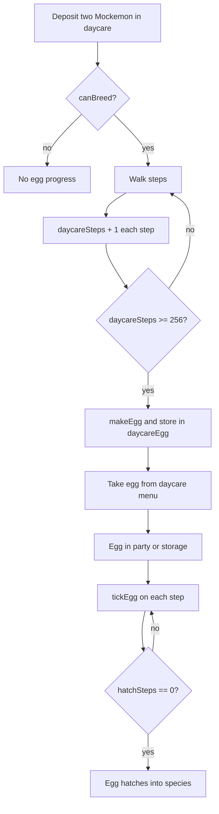

# Breeding
Active contributors: Keigo

## Purpose
Explain daycare breeding flow in `src/game.ts` and egg generation rules in `src/breeding.ts`.

## Daycare flow in game state
- NPC dialogue entry point: `daycareDialogue()`.
- Management menu: `openDaycareMenu()`.
- Depositing removes party members into `daycare` slots.
- Taking back returns deposited Mockemon to party.
- Egg state is tracked in `daycareEgg`.
- Step progress is tracked in `daycareSteps`.

In `onStepComplete()`:
- If two daycare slots are filled and `canBreed` is true, `daycareSteps` increases each step.
- At 256 steps, `daycareEgg = makeEgg(parentA, parentB)` and `daycareSteps` resets.
- Party eggs tick each step through `tickEgg(m, 1)`.

## Compatibility rules
`breedError` and `canBreed` enforce:
- Eggs cannot breed.
- Genderless non-Mimic species cannot breed.
- Parents must be opposite genders under the implemented gender checks.
- At least one parent with egg group `Mimic` can bypass the shared egg-group requirement.
- If neither is Mimic, parents must share at least one egg group.

## Egg generation rules
`makeEgg(a, b)` behavior:
- Egg species comes from the female parent, or from the non-Mimic parent when paired with a Mimic-group parent.
- 3 IV stats are inherited from parents, selected randomly.
- Other IVs roll randomly.
- Nature is copied from the species parent 50 percent of the time, otherwise random.
- Ability is the first species ability 80 percent of the time, otherwise random from the species ability list.
- Move list builds egg moves first, then level 1 moves, unique-only, capped to 4 total.
- Egg defaults include:
  - `hatchSteps = 512`
  - `friendship = 120`
  - `isEgg = true`

## Hatching behavior
`tickEgg` reduces `hatchSteps` by walked steps. At zero:
- `isEgg` becomes false,
- nickname resets to species name,
- stats are recalculated and HP is set to full.

## Breeding flow

## Related pages
- [Evolution](evolution.md)
- [Mockemon primitive](../primitives/mockemon.md)
