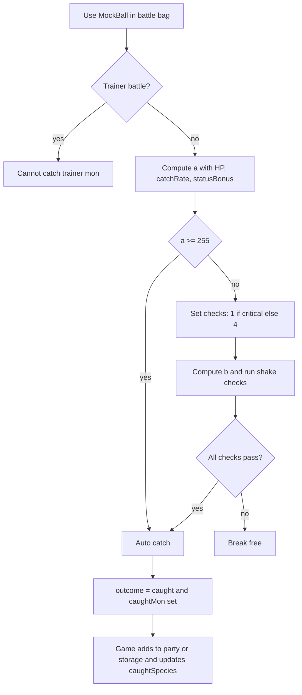

# Catching
Active contributors: Keigo

## Purpose
Document how wild Mockemon capture works from the battle bag in `src/game.ts` and `Battle.tryCatch` in `src/battle.ts`.

## Player flow
1. In battle, choose `BAG`.
2. Select `MockBall`.
3. The action calls `Battle.tryCatch`.
4. If successful, battle outcome becomes `'caught'`.
5. In `Game.startWildBattle` callback, the caught Mockemon is added to party if there is room, otherwise to storage.
6. `caughtSpecies` is updated for the caught species.

Trainer battles block capture attempts and show a failure message.

## Catch formula
`Battle.tryCatch` computes:

`a = min(255, ((3*maxHp - 2*hp) * catchRate * statusBonus) / (3*maxHp))`

Where:
- `statusBonus = 2` for `SLP` or `FRZ`
- `statusBonus = 1.5` for other status
- `statusBonus = 1` for no status

If `a >= 255`, the catch succeeds automatically.

Otherwise:
- Critical capture chance is 12 percent.
- On critical capture, run 1 shake check.
- Otherwise, run 4 shake checks.

Shake threshold:

`b = floor(65536 / (255 / a)^0.1875)`

Each check succeeds if random `[0,65535]` is less than `b`.

## Catch resolution flow

## Related pages
- [Battle engine overview](../systems/battle-engine/index.md)
- [MockDex](mockdex.md)
