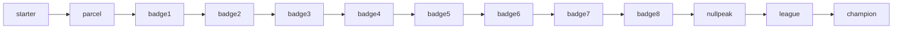

# Quests
Active contributors: KeigoShimadaCC

## Purpose
Explain how quest state is modeled in code, where quest content is authored, and how gameplay systems advance quests during scripts, gym wins, and menu flow.

## Directory layout
```text
src/
├─ quests.ts                  # QuestLog runtime and quest data model
├─ content/
│  └─ quests.ts               # Authored quest definitions (main + side)
├─ script.ts                  # ScriptCmd types and ScriptRunner quest commands
└─ game.ts                    # Quest lifecycle wiring, rewards, menu/objective UI
```

## Key abstractions
| Symbol | Kind | Role |
| --- | --- | --- |
| `QuestStage` (`id`, `objective`, `journal`) | interface | Defines each stage’s objective text and journal text in `src/quests.ts`. |
| `QuestReward` (`item`, `count`, `money`, `mon`) | interface | Declares reward payloads in `src/quests.ts`; consumed by `Game.questComplete` in `src/game.ts`. |
| `QuestDef` (`id`, `title`, `kind`, `act`, `stages`, `reward`, `giver`) | interface | Full quest definition shape used by `QUESTS` in `src/content/quests.ts`. |
| `QuestProgress` | type alias | Save payload (`stage`, `done`) keyed by quest id in `src/quests.ts`. |
| `QuestLog` | class | Runtime engine for start/advance/complete/state/query/serialize in `src/quests.ts`. |
| `questStart` / `questAdvance` / `questComplete` | `ScriptCmd` variants | Script entry points that mutate quest state via `ScriptRunner` in `src/script.ts`. |

## How it works
`Game` owns a `QuestLog` instance (`quests`) and exposes it through the `ScriptHost` methods `questStart`, `questAdvance`, and `questComplete` in `src/game.ts`. `ScriptRunner` dispatches quest commands from authored scripts to those host methods in `src/script.ts`.

`QuestLog` behavior in `src/quests.ts`:
- `start(id)`: initializes a quest at stage `0` if it is not already tracked.
- `advance(id, stage?)`: moves to next stage, or jumps to a named stage id.
- `complete(id)`: marks quest done.
- `state(id)`: returns `{ active, done, stage }`.
- `stageIndex(id)`: returns the numeric stage pointer.
- `active()` / `completed()`: returns sorted quest defs.
- `nextObjective()`: prioritizes an active `main` quest objective, then falls back to a `side` quest objective.
- `journal(id)`: returns journal entries up to current stage.
- `toJSON()`: serializes progress for saves.

Sorting is “main first, then side,” then by `act`, then by id (`sortDefs`) in `src/quests.ts`.

### Main journey stage flow


Main-journey stages are authored in `main_journey` under `src/content/quests.ts`.

### Authored quests
`src/content/quests.ts` defines:
- Main: `main_journey` (13 stages: `starter` → `parcel` → `badge1`..`badge8` → `nullpeak` → `league` → `champion`)
- Side: `parcel`, `lost_nibbit`, `hiker_trade`, `contest`, `daycare_egg`, `fossil`, `lighthouse`, `gauntlet`, `berries`, `sky_feather`, `observatory_ghost`, `dex_milestones`

Reward shapes used by side quests include:
- Item rewards (`moonstone`, `swiftfeather`, `luckycharm`, `tidecharm`, `powerband`, `sitrusberry`, `safetysash`, `leftovers`) in `src/content/quests.ts`
- Mockemon rewards (`bouldron`, `pebblit`) in `src/content/quests.ts`

### Runtime drivers
- Starter selection starts `main_journey`, advances it to `parcel`, and starts `parcel` in `openStarterMenu()` (`src/game.ts`).
- Script commands advance and complete quests (examples: `ball_giver`, `woods_grunt_block`, `contest_signup`, `gauntlet_enter`) in `src/content/scripts/index.ts`.
- Gym wins call `awardBadge(gym, ...)`, which advances `main_journey` by `gym.questStage` from `GYMS` in `src/content/gyms.ts` and `src/game.ts`.
- Champion win advances `main_journey` to `champion` and completes it in `onChampionDefeated()` (`src/game.ts`).

### Objective + journal UI
- Start menu reads `quests.nextObjective()` and shows a “NEXT” objective block in `openStartMenu()` (`src/game.ts`).
- Quest menu combines `quests.active()` + `quests.completed()` and shows latest journal line from `quests.journal(id)` in `openQuestMenu()` (`src/game.ts`).

## Integration points
- [Scripting](../systems/scripting.md): quest commands are part of `ScriptCmd` in `src/script.ts`.
- [Story progression](story-progression.md): main quest stages align to region arc and badge progression (`src/content/quests.ts`, `src/content/gyms.ts`).
- [Content pipeline](../systems/content-pipeline.md): quest content is authored data in `src/content/quests.ts`.

## Entry points for modification
- Add/edit quest definitions: `src/content/quests.ts`
- Change quest engine behavior (sorting, objective selection, serialization): `src/quests.ts`
- Add scripted quest transitions: `src/content/scripts/index.ts`
- Add non-script quest transitions (badge/champion hooks): `src/game.ts`, `src/content/gyms.ts`

## Key source files
| File | Why it matters |
| --- | --- |
| `src/quests.ts` | Quest data model and `QuestLog` implementation. |
| `src/content/quests.ts` | Main and side quest authoring data. |
| `src/script.ts` | Quest script command types and execution wiring. |
| `src/content/scripts/index.ts` | Concrete scripted quest start/advance/complete usage. |
| `src/content/gyms.ts` | Gym-to-quest stage handoff via `questStage`. |
| `src/game.ts` | Runtime ownership (`quests`), reward payout, and menu/objective UI. |
