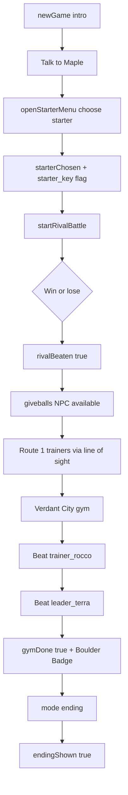

# Story progression
Active contributors: Keigo

## Purpose
Describe the demo story flow controlled by flags and battle outcomes in `src/game.ts`, with links to related overworld, trainer AI, and catching systems.

## Demo arc sequence
`newGame()` starts the player in the lab and shows the opening Professor Maple dialogue.

From there, progression is:
1. Talk to Maple (`starterDialogue()`), then choose a starter in `openStarterMenu()`.
2. Starter options are Sproutle, Cindercub, and Puddlefin.
3. Choosing one sets:
   - `flags.starterChosen = true`
   - `flags.starter_<key> = true` (for example `starter_sproutle`)
4. Leaving the lab triggers `startRivalBattle()` when the player reaches the exit row.
5. Rival Kai picks the counter starter:
   - `sproutle -> cindercub`
   - `cindercub -> puddlefin`
   - `puddlefin -> sproutle`
6. Win or lose, `flags.rivalBeaten = true`.
   - On loss, progression still continues and Maple heals your party.
7. Back in Maple Town, the old man (`action: giveballs`) appears after starter choice and grants `5 MockBalls + 2 Potions` once, setting `flags.gotBalls = true`.
8. Route 1 progression uses trainer line-of-sight checks (`inSight` + trainer `sight` values in map data).
9. In the gym, the sequence is Gym Trainer Rocco (`trainer_rocco`) then Leader Terra (`leader_terra`).
10. Defeating `leader_terra` sets `flags.gymDone = true`, adds `"Boulder Badge"` to `badges`, and switches to `mode = 'ending'`.
11. Confirming the ending screen sets `endingShown = true` and returns to overworld.

## Starter gate and progression gating
- In `onStepComplete()`, warp from Maple Town north to Route 1 is blocked until `flags.starterChosen` is true.
- NPC visibility is also flag-gated through map fields `hiddenUntilFlag` and `hiddenAfterFlag`.

## Whiteout behavior
When the player loses a battle and has no usable party members:
- `whiteOut()` removes half current money (`Math.floor(this.money / 2)`),
- heals the full party,
- respawns the player at `healPoint`,
- shows whiteout dialogue.

## Story flag flow

## Related pages
- [Overworld system](../systems/overworld.md)
- [Trainer AI](../systems/battle-engine/trainer-ai.md)
- [Catching](catching.md)
