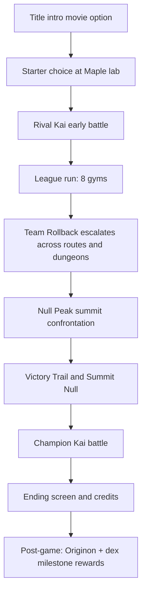

# Story progression
Active contributors: KeigoShimadaCC

## Purpose
Describe the full Mocca-region story arc and where progression state is stored and advanced across flags, quests, gym clears, and script events.

## Directory layout
```text
src/
├─ content/
│  ├─ gyms.ts                 # League order, badge flags, obedience caps, quest stage handoff
│  ├─ quests.ts               # main_journey stage authoring
│  └─ scripts/index.ts        # Story and side-scene script beats
└─ game.ts                    # Starter flow, gym/champion outcomes, ending and credits
```

## Key abstractions
| Symbol | Kind | Role |
| --- | --- | --- |
| `GYMS` | data array | Defines the 8-gym sequence, leaders, badges, flags, cap, and `questStage` in `src/content/gyms.ts`. |
| `main_journey` | quest def | Canonical story stage list in `src/content/quests.ts`. |
| `SCRIPTS` | data dictionary | Scripted scene and event library (`quest*`, `setFlag`, `battle`, dialogue) in `src/content/scripts/index.ts`. |
| `awardBadge` | method | Sets badge flags, records badge, advances `main_journey`, opens league when all gyms are cleared in `src/game.ts`. |
| `onChampionDefeated` | method | Sets `championBeaten` + `postGame`, completes `main_journey`, enters ending in `src/game.ts`. |
| `playIntro` / `startCredits` | methods | Intro movie and credits transitions in `src/game.ts`. |

## How it works
Progress is data-driven and tracked by two layers:
- **Flags** (`flags.*` in `src/game.ts`) gate world events (`gotBalls`, `badge_*`, `leagueOpen`, `postGame`, etc.).
- **Quest stage** (`main_journey` in `src/content/quests.ts`) tracks high-level arc milestones.
- **Defeated trainer state** (`defeatedTrainers` in `src/game.ts`) prevents repeat trainer triggers and records progression through mandatory battles.

`openStarterMenu()` starts the journey (`main_journey -> parcel`) and initializes the side parcel quest in `src/game.ts`. Gym wins call `awardBadge()`, which advances `main_journey` using each gym’s `questStage` in `src/content/gyms.ts` and `src/game.ts`. Champion victory completes the arc and moves to ending/credits in `onChampionDefeated()` and `startCredits()` (`src/game.ts`).

### Act flow


## 8-gym league path
| # | Town | Leader | Type | Badge | Cap |
| --- | --- | --- | --- | --- | --- |
| 1 | Verdant City | Terra | Rock | Boulder Badge | 14 |
| 2 | Thornbury | Weave | Bug | Silk Badge | 18 |
| 3 | Tidewell Town | Nerin | Water | Tide Badge | 24 |
| 4 | Voltmere City | Dyna | Electric | Surge Badge | 30 |
| 5 | Bloomrest | Fern | Grass | Bloom Badge | 35 |
| 6 | Cinderwake | Pyra | Fire | Ember Badge | 40 |
| 7 | Zephyr Heights | Aeris | Flying | Gale Badge | 45 |
| 8 | Somnium Town | Mira | Psychic | Dream Badge | 50 |

All values come from `GYMS` in `src/content/gyms.ts`. Badge wins set each gym’s `badgeFlag` (for example `badge_boulder`, `badge_tide`, `badge_dream`) and move `main_journey` forward via `questStage` in `awardBadge()` (`src/game.ts`).

## Team Rollback beats
`SCRIPTS` in `src/content/scripts/index.ts` holds the core antagonist beats, including:
- `woods_grunt_block`: Verdant Woods route lock and battle gate.
- `cave_dredge_scene`: Seaside Cave excavation scene.
- `powerplant_intro` + `powerplant_boss`: Voltmere power siphon escalation.
- `skybridge_chase` + `skybridge_rescue`: Juno kidnapping and rescue.
- `nullpeak_intro` + `nullpeak_confrontation`: summit setup and Director Nil confrontation.
- `originon_awaken`: post-game Originon awakening/join event.

These scenes use flag checks and script commands (`if`, `setFlag`, `battle`, `say`, and quest commands) from `src/script.ts`.

## Champion, ending, and post-game
- Champion win path is handled in `onChampionDefeated()` (`src/game.ts`): sets `championBeaten`, sets `postGame`, advances/completes `main_journey`, then switches to `mode = 'ending'`.
- Ending confirmation starts credits (`startCredits()`), and credits summarize badges/dex/playtime/party in `src/game.ts`.
- Post-game includes:
  - Originon event in `originon_awaken` script (`src/content/scripts/index.ts`).
  - Maple’s dex milestone reward loop in `maple_postgame` script (`src/content/scripts/index.ts`).

## Integration points
- [Quests](quests.md): `main_journey` is the story backbone.
- [Scripting](../systems/scripting.md): story events are script-command-driven.
- [Cutscenes](../systems/cutscenes.md): script scenes and cinematic event staging.

## Entry points for modification
- Change league order/caps/badge mapping: `src/content/gyms.ts`
- Change story stage text/objectives: `src/content/quests.ts`
- Add or edit story beats and branching flags: `src/content/scripts/index.ts`
- Change starter/champion/ending transitions: `src/game.ts`

## Key source files
| File | Why it matters |
| --- | --- |
| `src/content/gyms.ts` | Canonical 8-gym data and quest-stage handoff. |
| `src/content/quests.ts` | Main story quest stage authoring (`main_journey`). |
| `src/content/scripts/index.ts` | Team Rollback, Kai, Null Peak, post-game script beats. |
| `src/script.ts` | Command types and execution model for story scripts. |
| `src/game.ts` | Runtime progression state, gym/champion handling, ending and credits flow. |
