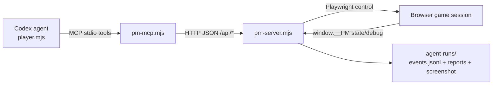

# Agent harness
Active contributors: KeigoShimadaCC

## Purpose

This page documents the AI agent harness in `tools/agent/`: what it is for, how its parts fit together, and where to modify behavior safely.

The harness is for live, reproducible gameplay and exploratory QA. It runs a Codex agent against a real browser session, records structured events, and writes run reports for review (`tools/agent/player.mjs`, `tools/agent/pm-server.mjs`, `tools/agent/pm-mcp.mjs`, `tests/agent.spec.ts`).

## Directory layout

`tools/agent/` currently contains:

- `player.mjs`: CLI entry point that starts a run, launches `pm-server`, starts a Codex thread, and drives turn-by-turn play (`tools/agent/player.mjs`).
- `pm-server.mjs`: HTTP API + Playwright runtime that hosts the real game session, serializes actions, tracks anomalies/milestones, and writes artifacts (`tools/agent/pm-server.mjs`).
- `pm-mcp.mjs`: Model Context Protocol bridge that exposes game tools (`pm_state`, `pm_walk`, `pm_battle`, and others) over stdio (`tools/agent/pm-mcp.mjs`).
- `profiles.json`: profile presets with model/effort/speed/debug policy and system prompt (`tools/agent/profiles.json`).

## Key abstractions

| Abstraction | Location | Role |
| --- | --- | --- |
| Codex run orchestrator | `tools/agent/player.mjs` | Parses CLI flags, loads a profile, starts/stops server + agent loop, and finalizes reports. |
| MCP tool surface | `tools/agent/pm-mcp.mjs` | Defines the tool contract the agent can call (`pm_new_game`, `pm_press`, `pm_walk`, `pm_state`, `pm_map`, `pm_wait`, `pm_battle`, `pm_grind`, `pm_continue`, `pm_set_speed`, `pm_debug`, `pm_report_note`). |
| Browser gameplay runtime | `tools/agent/pm-server.mjs` | Runs Vite + Playwright, executes actions against `window.__PM`, and exposes `/api/*`. |
| Run artifacts | `agent-runs/<run-id>/` | Stores `events.jsonl`, `report.md`, `report.json`, and `final.png` for each run. |

## How it works

1. `player.mjs` reads a profile and CLI overrides, then spawns `pm-server.mjs` with run metadata (`--profile`, `--goal`, `--seed`, `--speed`, `--model`, `--effort`, ports) (`tools/agent/player.mjs`).
2. `pm-server.mjs` boots Vite + Playwright, loads the game page, and calls `window.__PM` methods from `src/main.ts` to read state and execute inputs/debug actions (`tools/agent/pm-server.mjs`, `src/main.ts`).
3. `player.mjs` starts a Codex thread (`@openai/codex-sdk`) with an MCP server config pointing to `pm-mcp.mjs` (`tools/agent/player.mjs`).
4. `pm-mcp.mjs` forwards MCP tool calls to `pm-server` HTTP endpoints (`/api/state`, `/api/walk`, `/api/battle`, etc.) (`tools/agent/pm-mcp.mjs`, `tools/agent/pm-server.mjs`).
5. `pm-server.mjs` logs every run event to JSONL, tracks milestones/anomalies/warnings, and builds Markdown + JSON reports at finalize (`tools/agent/pm-server.mjs`).



For game-loop timing and the `__PM` surface that powers this, see [Game loop](../systems/game-loop.md). For script/cutscene behavior the agent traverses, see [Scripting](../systems/scripting.md). For normal test suites, see [Testing](testing.md).

## Profiles

Profiles are declared in `tools/agent/profiles.json`:

- `casual-kid`: `model: "gpt-5.4-mini"`, `effort: "low"`, `speed: 2`, `debugAllowed: false`.
- `speedrunner`: `model: "gpt-5.6-sol"`, `effort: "high"`, `speed: 6`, `debugAllowed: false`.
- `qa-adversary`: `model: "gpt-5.5"`, `effort: "medium"`, `speed: 4`, `debugAllowed: true`.

Each profile also carries a role-specific system prompt (`tools/agent/profiles.json`).

## CLI usage and flags

Run the harness with:

```bash
npm run agent:play -- --profile casual-kid --goal "Beat gym leader Rocco and earn the badge"
```

The player CLI supports:

- `--profile`
- `--goal`
- `--seed`
- `--max-turns`
- `--max-minutes`
- `--headless`
- `--model`
- `--effort`
- `--speed`
- `--run-id`
- `--port`
- `--vite-port`

(`tools/agent/player.mjs`)

Determinism and pacing controls:

- `--seed` is passed through to the game URL (`?seed=`) when starting fresh (`tools/agent/pm-server.mjs`).
- `--speed` sets the runtime multiplier used by server-side input pacing and can be changed during a run via `pm_set_speed` (`tools/agent/pm-server.mjs`, `tools/agent/pm-mcp.mjs`).

## Output artifacts

Each run writes to `agent-runs/<run-id>/`:

- `events.jsonl`: full event stream (`run_start`, `tool_call`, `tool_result`, `milestone`, `warning`, `anomaly`, notes/messages, `run_end`).
- `report.md`: human-readable summary with status, final state, milestones, notes, anomalies, warnings.
- `report.json`: machine-readable report payload.
- `final.png`: end-of-run screenshot.

(`tools/agent/pm-server.mjs`, validated by `tests/agent.spec.ts`)

## Integration points

- npm scripts:
  - `agent:play` → `node tools/agent/player.mjs`
  - `agent:server` → `node tools/agent/pm-server.mjs`
  (`package.json`)
- The harness depends on the browser debug/test contract exposed from `src/main.ts` (`window.__PM.press`, `window.__PM.state`, and `window.__PM.debug.*`).
- End-to-end validation for the harness itself lives in `tests/agent.spec.ts`.

## Entry points for modification

- Agent behavior/prompting/turn protocol: `tools/agent/player.mjs`
- Tool names, schemas, and descriptions: `tools/agent/pm-mcp.mjs`
- Runtime API semantics, logging, reporting, and stabilization logic: `tools/agent/pm-server.mjs`
- Persona presets and defaults: `tools/agent/profiles.json`
- Regression checks for harness functionality: `tests/agent.spec.ts`
