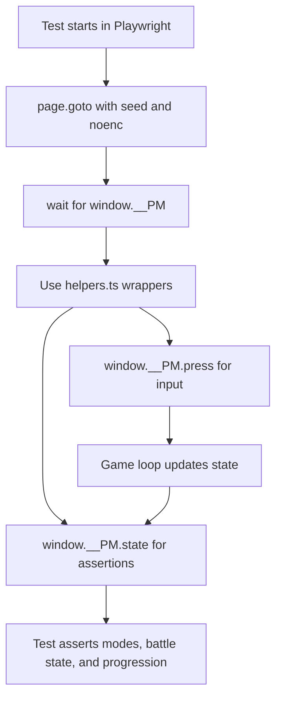

# Testing

## Purpose

This page explains the test suites, deterministic setup, and common patterns for writing new tests.

## Test suites

This repository has two separate suites:

- Unit tests with Vitest, configured in `vitest.config.ts` to include only `tests/unit/**/*.test.ts`.
- End-to-end tests with Playwright, configured in `playwright.config.ts` to run `tests/*.spec.ts` with a local dev server.

## Running tests

- Unit tests: `npm test`
- End-to-end tests: `npm run test:e2e`
- Full local gate: `npm run lint && npm run typecheck && npm test && npm run test:e2e`

## What each suite covers

### Unit tests (Vitest)

Unit tests in `tests/unit/` directly import battle, mockemon, and data modules. They include focused behavioral coverage such as:

- `battle.test.ts` with extensive adversarial battle cases
- `breeding.test.ts`
- `data.test.ts`
- `daynight.test.ts`
- `evolution.test.ts`
- `growth.test.ts`
- `mockemon.test.ts`
- `stats.test.ts`

These tests use seeded RNG to keep outcomes reproducible.

### End-to-end tests (Playwright)

End-to-end tests in `tests/` drive the running game and assert full-system behavior:

- `smoke.spec.ts`
- `mechanics.spec.ts`
- `systems.spec.ts`
- `journey.spec.ts`

They cover full flows such as new game progression, battles, map traversal, persistence, and key system interactions.

## Determinism and seeds

Determinism is critical for reliable tests:

- Use URL params like `/?seed=1234&noenc=1` in browser-driven tests.
- Use `setSeed(...)` in unit tests before logic that depends on randomness.
- Keep no-encounter runs enabled when testing scripted progression.

See also [RNG](../systems/rng.md).

## The `window.__PM` API for end-to-end tests

`src/main.ts` installs `window.__PM` for debug and automation:

- `press(key)` to inject inputs.
- `state()` to capture a full game snapshot.
- `debug.*` helpers to control setup and state.

Common debug helpers:

- `setSeed`, `noEncounters`
- `warp`, `setPartyLevels`, `givemon`, `addItem`
- `setTime`, `hatchEggs`, `setHeldItem`, `depositDaycare`, `walk`
- `drainPP`, `healAll`, `clearInput`, `clearSave`

## `tests/helpers.ts` utilities

`tests/helpers.ts` wraps Playwright calls into reusable helpers:

- `state(page)`: read current snapshot from `window.__PM.state()`.
- `press(page, key, times?)`: send one or repeated virtual inputs.
- `waitMode(page, mode)`: wait until game mode matches expected value.
- `step(page, dir)` and `walk(page, dir, tiles)`: movement helpers that wait for animation completion.
- `advanceDialogue(page)`: progress dialogue safely.
- `settle(page)`: resolve post-battle dialogue and menus back to a top-level mode.
- `battleLoop(page, opts)`: run a battle to completion while collecting battle messages.
- `newGameWithStarter(page, seed, starterIndex?)`: scripted setup from title to overworld with selected starter.

See also [Debugging](debugging.md) and [Tooling](tooling.md).

## Writing a new unit test

Typical pattern:

1. Add a test file in `tests/unit/` or extend an existing one.
2. Import the module under test directly.
3. Call `setSeed(...)` for deterministic paths.
4. Set up inputs and assert exact outputs or state transitions.

Keep each test focused on a single rule or interaction.

## Writing a new end-to-end test

Typical pattern:

1. Add a `*.spec.ts` file under `tests/`.
2. `page.goto('/?seed=...&noenc=1')`.
3. Wait for `window.__PM` to be ready.
4. Use `tests/helpers.ts` functions for movement, dialogue, and battle flows.
5. Assert game state snapshots from `state(page)`.

For loop and state timing details, see [Game loop](../systems/game-loop.md).

## Balance simulation as a test-like signal

Use `tools/simulate.ts` for headless campaign difficulty checks:

- Run with `npx tsx tools/simulate.ts`.
- It replays story fights with the real battle engine under seeded trials.
- Treat major regressions in badge rate or whiteout patterns as blockers for battle balance changes.

Related background: [Balance simulation](../background/balance-simulation.md).

## End-to-end flow diagram

