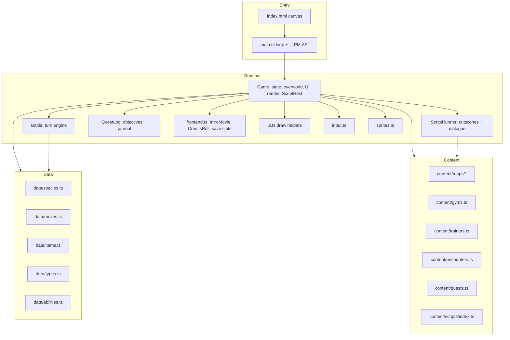
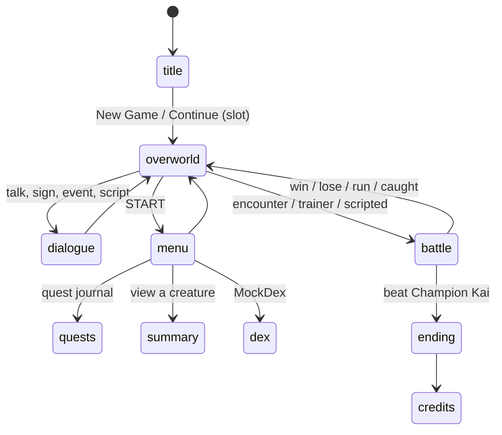

# Architecture

Pocket Mockster is a single-page browser game. `index.html` hosts one `<canvas>` element, and `src/main.ts` boots a fixed-timestep game loop that drives a single `Game` object. The `Game` owns all runtime state and delegates combat to a `Battle` object, cutscene/dialogue flow to a `ScriptRunner`, and quest tracking to a `QuestLog`. Everything the game describes (species, moves, maps, gyms, quests, cutscenes) is plain data in `src/data/` and `src/content/`.

## The four layers



- **Entry layer** (`src/main.ts`): creates the canvas context, seeds the RNG from a URL parameter, wires keyboard input, plays the intro movie on first boot, and runs a 60 Hz fixed-step loop that calls `game.update()` then `game.render()`. It also installs `window.__PM`, a debug and end-to-end testing API, and holds a `speed` multiplier so tests and the agent harness can fast-forward.
- **Runtime layer**: the `Game` class (`src/game.ts`) is the hub. It holds the party, inventory, flags, current map, active battle, quest log, and script runner. `Game implements ScriptHost`, so the scripting engine drives dialogue, battles, item grants, warps, and quest updates through it. Combat is handed to a `Battle` instance (`src/battle.ts`).
- **Content layer** (`src/content/`): typed records describing maps, gyms, trainers, encounter tables, quests, and cutscene scripts. Aggregated into lookup maps and validated by `content/validate.ts`. See [Content pipeline](../systems/content-pipeline.md).
- **Data layer** (`src/data/`): plain records for species, moves, items, types, and abilities. Immutable at runtime; a captured creature is built from a species def by `createMockemon`.

## The main loop

`main.ts` accumulates real elapsed time (scaled by `speed`) and steps the simulation in fixed 1/60-second increments, so game logic is frame-rate independent while rendering runs once per animation frame.

```mermaid
sequenceDiagram
    participant RAF as requestAnimationFrame
    participant Loop as main.ts loop
    participant Game
    RAF->>Loop: timestamp t
    Loop->>Loop: acc += clamp(t - last, 100) * speed
    loop while acc >= 1000/60
        Loop->>Game: update()
        Loop->>Loop: acc -= step
    end
    Loop->>Game: render()
    Loop->>RAF: request next frame
```

Full detail lives in [Game loop](../systems/game-loop.md).

## The Game state machine

The `Game` object is a mode-driven state machine. Its `mode` field selects which update and render path runs each frame. The boot movie and end credits render as overlays (`game.intro`, `game.credits`) driven by the [sequence engine](../systems/cutscenes.md).



Scripted events (`ScriptCmd[]`) run through a `ScriptRunner` that can pause the overworld for dialogue, choices, battles, warps, and quest updates. See [Scripting](../systems/scripting.md).

## How a turn flows through combat

When the `Game` starts a battle it constructs a `Battle` with the live party array (by reference, so HP and EXP changes persist). The battle UI collects a `PlayerAction`, calls `battle.takeTurn(action)`, and receives message strings to display. `Battle` handles move ordering, damage, status, field effects, fainting, EXP, and evolution triggers internally.

```mermaid
graph LR
    UI[Game battle UI] -->|PlayerAction| TakeTurn[Battle.takeTurn]
    TakeTurn -->|enemy AI picks move| AI[enemyPickMove]
    TakeTurn -->|resolve in speed order| UseMove[useMove: damage, status, field]
    UseMove -->|faint checks| Faint[handle faint + grant EXP]
    Faint -->|string[]| UI
```

The engine is split into focused concerns documented under [Battle engine](../systems/battle-engine/index.md).

## Rendering

All drawing is immediate-mode canvas 2D. Every frame the current mode paints from scratch: tiles are drawn procedurally in `drawTile`, creatures and people use pixel-grid sprites from `src/sprites.ts`, and UI panels/text use shared helpers now extracted to [`src/ui.ts`](../systems/rendering.md) (`text`, `panel`, `hpBar`, `wrap`, `paginate`, `formatPlaytime`). There is no retained scene graph and no DOM UI beyond the canvas.

## Determinism and testing

The RNG (`src/rng.ts`) is a seedable xorshift generator. Passing `?seed=N` fixes the sequence, and `?noenc=1` disables wild encounters. Combined with the `window.__PM` state/debug API and the loop `speed` multiplier, the game is scriptable for Playwright end-to-end tests, the headless balance simulator in `tools/`, and the [AI agent harness](../how-to-contribute/agent-harness.md). See [Testing](../how-to-contribute/testing.md) and [Design decisions](../background/design-decisions.md).

## Module map

| Module | Role |
|---|---|
| `src/main.ts` | Boot, loop, `speed`, `window.__PM` debug API |
| `src/game.ts` | Game state, overworld, menus, battle UI, quests, save/load, rendering; implements `ScriptHost` |
| `src/battle.ts` | Turn-based combat engine |
| `src/mockemon.ts` | Creature instance model: stats, EXP, leveling, healing |
| `src/quests.ts` | `QuestLog`: quest state, objectives, journal |
| `src/script.ts` | `ScriptRunner` and the `ScriptCmd` cutscene/dialogue language |
| `src/sequence.ts` | Frame-based tween/animation sequencing (`Sequence`, `tween`, `fade`, `typeText`, `Fader`) |
| `src/frontend.ts` | Intro movie, end credits, save-slot title screen |
| `src/ui.ts` | Shared canvas draw helpers |
| `src/breeding.ts` | Daycare egg creation and hatching |
| `src/evolution.ts` | Evolution trigger checks |
| `src/daynight.ts` | In-game clock phases and screen tint |
| `src/input.ts` | Keyboard to virtual-key mapping |
| `src/rng.ts` | Seedable pseudo-random generator |
| `src/sprites.ts` | Pixel-art sprite data and blitter |
| `src/maps.ts` | Thin re-export shim over `src/content/maps/` |
| `src/content/*` | Maps, gyms, trainers, encounters, quests, scripts, and their validator |
| `src/data/*` | Static species, moves, items, types, abilities |
