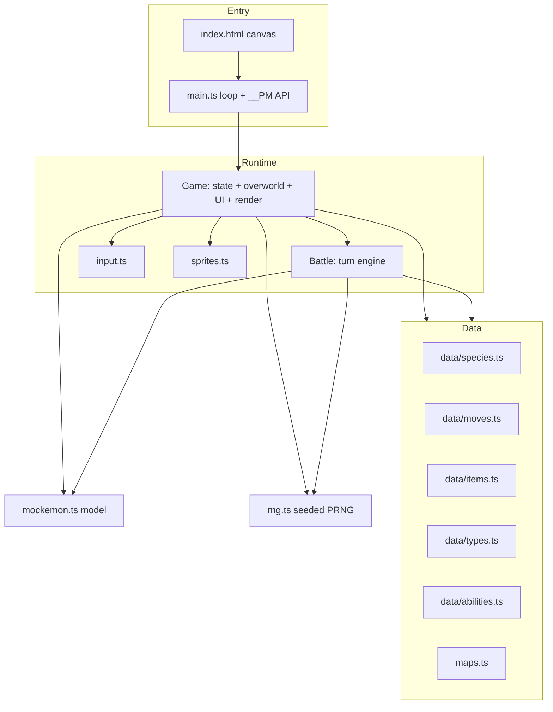
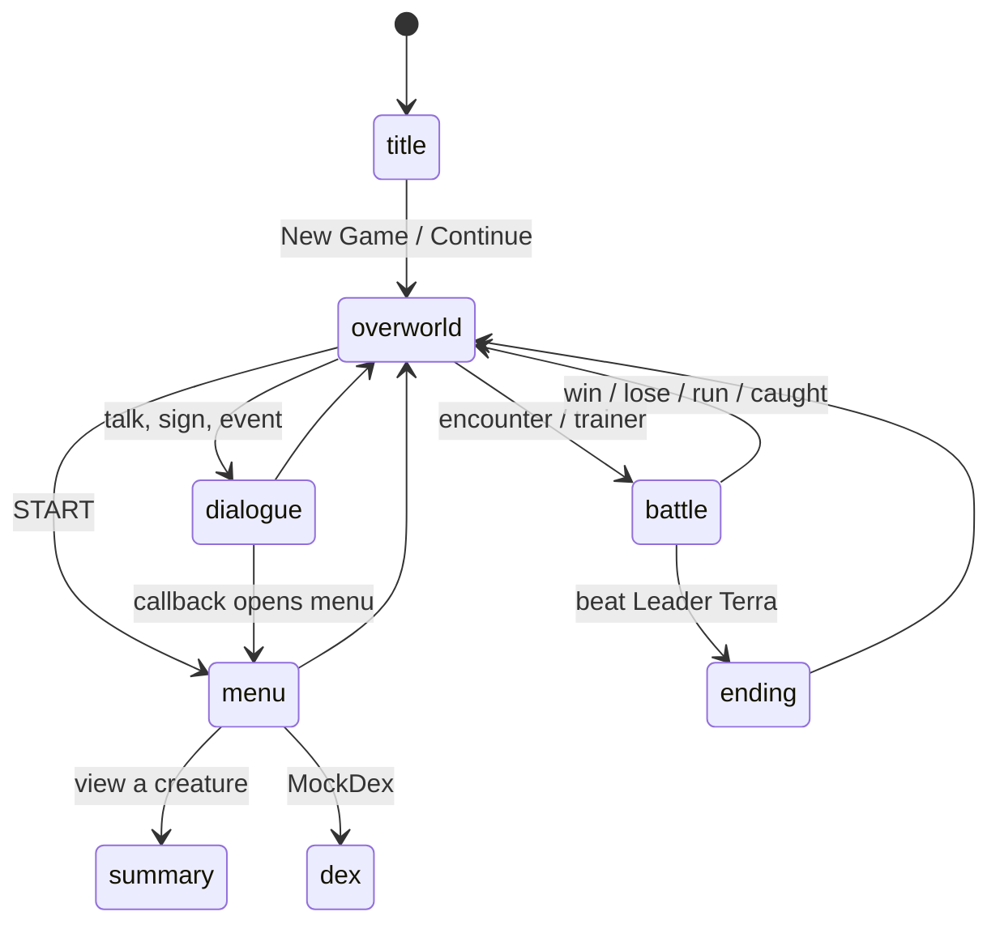

# Architecture

Pocket Mockster is a single-page browser game. `index.html` hosts one `<canvas>` element, and `src/main.ts` boots a fixed-timestep game loop that drives a single `Game` object. The `Game` owns all state and delegates the turn-based combat to a `Battle` object. Everything else is either static data (in `src/data/`) or a small stateless helper module.

## The three layers



- **Entry layer** (`main.ts`): creates the canvas context, seeds the RNG from a URL parameter, wires keyboard input, and runs a 60 Hz fixed-step loop that calls `game.update()` then `game.render()`. It also installs `window.__PM`, a debug and end-to-end testing API.
- **Runtime layer**: the `Game` class (`src/game.ts`) is the hub. It holds the party, inventory, flags, the current map, and the active battle. It reads input, mutates state, and paints every frame. Combat is handed off to a `Battle` instance (`src/battle.ts`) that runs a self-contained turn resolver and returns message strings.
- **Data layer**: plain TypeScript records describing species, moves, items, types, abilities, and maps. Data is immutable at runtime; instances (a specific captured creature) are built from it by `createMockemon`.

## The main loop

`main.ts` accumulates real elapsed time and steps the simulation in fixed 1/60-second increments, so game logic is frame-rate independent while rendering runs once per animation frame.

```mermaid
sequenceDiagram
    participant RAF as requestAnimationFrame
    participant Loop as main.ts loop
    participant Game
    RAF->>Loop: timestamp t
    Loop->>Loop: acc += clamp(t - last, 100)
    loop while acc >= 1000/60
        Loop->>Game: update()
        Loop->>Loop: acc -= step
    end
    Loop->>Game: render()
    Loop->>RAF: request next frame
```

Full detail lives in [Game loop](../systems/game-loop.md).

## The Game state machine

The `Game` object is a mode-driven state machine. Its `mode` field selects which update and render path runs each frame.



Modes are `title`, `overworld`, `dialogue`, `menu`, `battle`, `summary`, `dex`, and `ending`. See [Overworld](../systems/overworld.md) for how each mode is handled.

## How a turn flows through combat

When the `Game` starts a battle it constructs a `Battle` with the live party array (by reference, so HP and EXP changes persist). The battle UI in `Game` collects a `PlayerAction`, calls `battle.takeTurn(action)`, and receives an array of message strings to display. `Battle` handles move ordering, damage, status, field effects, fainting, EXP, and evolution triggers internally.

```mermaid
graph LR
    UI[Game battle UI] -->|PlayerAction| TakeTurn[Battle.takeTurn]
    TakeTurn -->|enemy AI picks move| AI[enemyPickMove]
    TakeTurn -->|resolve in speed order| UseMove[useMove: damage, status, field]
    UseMove -->|faint checks| Faint[handle faint + grant EXP]
    Faint -->|string[]| UI
```

The engine is split into focused concerns documented under [Battle engine](../systems/battle-engine/index.md).

## Rendering

All drawing is immediate-mode canvas 2D. Every frame the current mode paints from scratch: tiles are drawn procedurally in `drawTile`, creatures and people use pixel-grid sprites from `src/sprites.ts`, and UI panels/text use small local helpers (`panel`, `text`, `hpBar`, `wrap`). There is no retained scene graph and no DOM UI beyond the canvas. See [Rendering](../systems/rendering.md).

## Determinism and testing

The RNG (`src/rng.ts`) is a seedable xorshift generator. Passing `?seed=N` fixes the sequence, and `?noenc=1` disables wild encounters. Combined with the `window.__PM` state/debug API, this makes the whole game scriptable for Playwright end-to-end tests and for the headless balance simulator in `tools/`. See [Testing](../how-to-contribute/testing.md) and [Design decisions](../background/design-decisions.md).

## Module map

| Module | Role |
|---|---|
| `src/main.ts` | Boot, loop, `window.__PM` debug API |
| `src/game.ts` | Game state, overworld, menus, battle UI, save/load, rendering |
| `src/battle.ts` | Turn-based combat engine |
| `src/mockemon.ts` | Creature instance model: stats, EXP, leveling, healing |
| `src/breeding.ts` | Daycare egg creation and hatching |
| `src/evolution.ts` | Evolution trigger checks |
| `src/daynight.ts` | In-game clock phases and screen tint |
| `src/input.ts` | Keyboard to virtual-key mapping |
| `src/rng.ts` | Seedable pseudo-random generator |
| `src/sprites.ts` | Pixel-art sprite data and blitter |
| `src/maps.ts` | Map tiles, warps, NPCs, trainers, encounters |
| `src/data/*` | Static species, moves, items, types, abilities |
