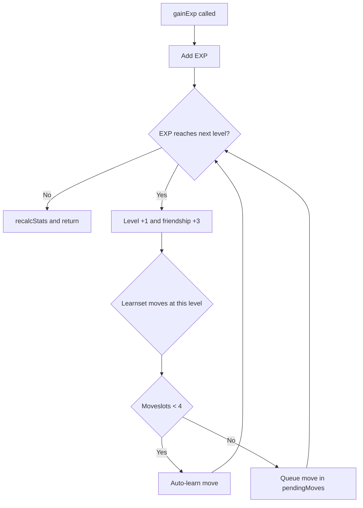

# Mockemon
Active contributors: Keigo

## Purpose
Define the runtime creature instance model and its lifecycle operations, from creation and stat math to experience gain, move learning, and evolution state updates.

## Definition
Defined in `src/mockemon.ts` as `Mockemon`:

- Identity and progression: `species`, `nickname`, `level`, `exp`
- Personality and rarity: `pv`, `shiny`, `nature`
- Genetics and training: `ivs`, `evs`
- Demographics and loadout: `gender`, `ability`, `heldItem`
- Affinity: `friendship`
- Current battle stats: `hp`, `maxHp`, `atk`, `def`, `spa`, `spd`, `spe`
- Moveset: `moves` (`MoveSlot[]`, each slot is `{ id, pp }`)
- Volatile status state: `status`, `sleepTurns`, `toxicCounter`
- Move-learning queue: `pendingMoves`
- Breeding state: optional `isEgg`, optional `hatchSteps`

## Natures
- Internal `NATURE_LIST` contains 25 natures.
- `NATURES` and `NATURE_KEYS` are derived lookup/index structures.
- Nature modifiers are `+10%` to one stat and `-10%` to another, with neutral natures having no modifier.
- Nature effects apply to non-HP stats only.

## Stat calculation
- `calcStat(base, iv, ev, level, isHp, nature, stat)` implements canon-style formulas:
  - Shared core: `floor(((2 * base + iv + floor(ev / 4)) * level) / 100)`
  - HP: `core + level + 10`
  - Other stats: `floor((core + 5) * natureMultiplier)`
- `recalcStats(m)` recalculates all derived stats from species base stats, IVs, EVs, level, and nature.
- `recalcStats` preserves HP ratio (`hp / maxHp`) when max HP changes.

## IVs and EVs
- IV range in `createMockemon`: each stat is rolled `0..31`.
- EV caps in `addEVs`:
  - Per-stat cap: `252`
  - Total cap: `510`
- EV gains are clipped by both caps, then stats are recalculated.

## Experience and leveling
- `expForLevel(rate, level)` supports all six growth rates:
  - `fast`, `mediumfast`, `mediumslow`, `slow`, `erratic`, `fluctuating`
- `gainExp(m, amount)`:
  - Adds EXP and loops levels while threshold is met (up to level 100)
  - Increases friendship by `+3` per level, capped at 255
  - Checks learnset entries at each new level
  - Auto-learns moves if fewer than 4 slots
  - Pushes move IDs into `pendingMoves` if already at 4 moves
  - Returns `LevelUpResult` with `learned` and `queued` move names
  - Recalculates stats at the end
- Evolution is not performed inside `gainExp`.

## Move-learning helpers
- `movesAtLevel(speciesKey, level)` collects unique learnset moves up to that level and returns the last 4.
- `learnMove(m, moveId, forgetIndex)`:
  - Rejects duplicates
  - Adds directly if fewer than 4 moves
  - Replaces one move if `forgetIndex` is valid

## Evolution and recovery helpers
- `evolve(m, toSpecies)` updates `species`, keeps custom nickname, and refreshes stats.
- `healFull(m)` restores HP to full, clears status/sleep/toxic counters, and restores PP.
- `changeFriendship(m, delta)` clamps friendship to `0..255`.

## Creation and identity helpers
- `createMockemon(speciesKey, level)` initializes instance state:
  - Rolls `pv`, `nature`, IVs, gender, and ability
  - Computes shiny via `isShiny(pv)`
  - Initializes friendship from species `baseFriendship` (fallback 70)
  - Seeds moves from `movesAtLevel`
  - Recalculates stats and sets current HP to full
- `isShiny(pv)` returns true when `((pv >>> 16) ^ (pv & 0xffff)) < 16` (about `1/4096`).
- `displayName(m)` appends `★` for shiny creatures.

## Related pages
- [Primitives index](./index.md)
- [Species](./species.md)
- [Move](./move.md)
- [Evolution feature](../features/evolution.md)
- [Battle engine overview](../systems/battle-engine/index.md)
