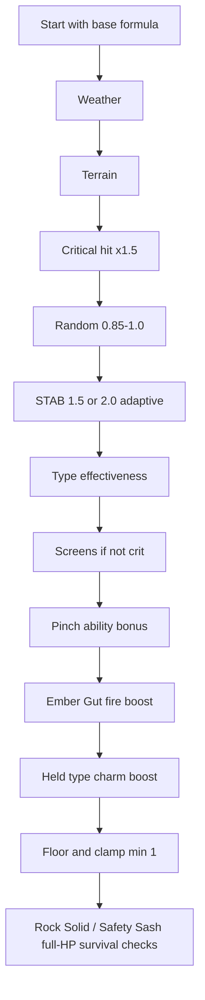

# Damage and type effectiveness
Active contributors: Keigo

Purpose: document `Battle.damage()` and adjacent hit-resolution mechanics in `src/battle.ts`, plus the type chart in `src/data/types.ts`.

## Related pages
- [Battle engine](./index.md)
- [Status and field effects](./status-and-field.md)
- [Abilities and held items](./abilities-and-items.md)
- [Move primitive](../../primitives/move.md)
- [Mockemon primitive](../../primitives/mockemon.md)
- [Data models](../../reference/data-models.md)

## Damage formula in `damage()`
For damaging moves, base damage is:

`base = floor(floor((2*level/5 + 2) * power * (atk/def)) / 50) + 2`

Where:
- `atk` comes from `atkStat(...)`
- `def` comes from `defStat(...)`, clamped to at least `1`

`atkStat` and `defStat` details:
- Physical uses `atk`/`def`; special uses `spa`/`spd`.
- Stage multipliers use `stageMult`.
- On crit:
  - attacker negative stages are ignored (`max(0, stage)`)
  - defender positive stages are ignored (`min(0, stage)`)
- `musclebound` doubles physical attack.
- `powerband` multiplies physical attack by `1.5`.
- Sandstorm boosts Rock special defense by `1.5` (`weather === 'sand'`, special hit, defender has Rock type).

Burn rule:
- If move is physical and attacker has `BRN`, attack is halved (`*0.5`).

## Modifier pipeline
After `base`, `mod` multiplies in this order:
1. Weather:
   - sun: Fire `1.5`, Water `0.5`
   - rain: Water `1.5`, Fire `0.5`
2. Terrain:
   - electric terrain +30% to Electric (`1.3`)
   - grassy terrain +30% to Grass (`1.3`)
3. Critical hit: `1.5` (1/16 chance)
4. Random roll: `0.85 + rand()*0.15`
5. STAB:
   - `1.5` if move type matches attacker type
   - `2.0` instead if attacker ability is `adaptive`
6. Type effectiveness multiplier
7. Screens (only if not crit):
   - Reflect halves physical (`0.5`)
   - Light Screen halves special (`0.5`)
8. Pinch abilities (`verdantforce`/`cinderheart`/`riptide`) at `hp <= floor(maxHp/3)`: `1.5` for matching type
9. `emberBoost` (from Ember Gut fire absorb): Fire `1.5`
10. Held type charm match (`ITEMS[held].typeBoost === move.type`): `1.2`

Final damage:
- `dmg = floor(base * mod)`
- minimum `1`

## Immunities and absorption before formula
`damage()` returns `0` early when:
- Ground move into `airborne` target.
- Water damaging move into `sponge` target (heals 25% max HP).
- Fire damaging move into `embergut` target (sets defender-side `emberBoost = true`).
- Type effectiveness is `0`.

## Survival effects at full HP
If target is at full HP and incoming damage is lethal:
- `rocksolid` ability leaves target at `1 HP`.
- `safetysash` item leaves target at `1 HP` and is consumed.

## Accuracy, evasion, and guaranteed-hit moves
`accuracyCheck(...)`:
- If `move.accuracy >= 999`, always hit.
- Else:
  - `diff = user.accStage - target.evaStage`
  - `p = (accuracy/100) * accMult(diff)`
  - hit if `chance(p)` succeeds

`accMult`:
- stage >= 0: `(3 + stage) / 3`
- stage < 0: `3 / (3 - stage)`

## Multi-hit, two-turn, drain, and recoil
- Multi-hit moves (`move.multiHit`) use sequential RNG checks:
  - `2` hits if `chance(0.35)`
  - else `3` if `chance(0.5)`
  - else `4` if `chance(0.5)`
  - else `5`
- Two-turn moves:
  - first turn sets `charging` and only prints charge text
  - second turn releases locked move
  - target is untargetable if currently in invulnerable charge state (`Dig`, `Fly`)
- Drain (`move.drain`): heal `floor(totalDmg * drain)`, minimum `1`.
- Recoil (`move.recoil`): self-damage `floor(totalDmg * recoil)`, minimum `1`.
- Max-HP recoil (`move.recoilMaxHp`, used by `struggle`): self-damage `floor(maxHp * recoilMaxHp)`, minimum `1`.

## Full type chart (`src/data/types.ts`)
Multiplier table: attacker type by defender type.

| Attacker \ Defender | Normal | Fire | Water | Grass | Electric | Rock | Ground | Bug | Flying | Psychic |
| --- | ---: | ---: | ---: | ---: | ---: | ---: | ---: | ---: | ---: | ---: |
| Normal | 1 | 1 | 1 | 1 | 1 | 0.5 | 1 | 1 | 1 | 1 |
| Fire | 1 | 0.5 | 0.5 | 2 | 1 | 0.5 | 1 | 2 | 1 | 1 |
| Water | 1 | 2 | 0.5 | 0.5 | 1 | 2 | 2 | 1 | 1 | 1 |
| Grass | 1 | 0.5 | 2 | 0.5 | 1 | 2 | 2 | 0.5 | 0.5 | 1 |
| Electric | 1 | 1 | 2 | 0.5 | 0.5 | 1 | 0 | 1 | 2 | 1 |
| Rock | 1 | 2 | 1 | 1 | 1 | 1 | 0.5 | 2 | 2 | 1 |
| Ground | 1 | 2 | 1 | 0.5 | 2 | 2 | 1 | 0.5 | 0 | 1 |
| Bug | 1 | 0.5 | 1 | 2 | 1 | 0.5 | 1 | 1 | 0.5 | 2 |
| Flying | 1 | 1 | 1 | 2 | 0.5 | 0.5 | 1 | 2 | 1 | 1 |
| Psychic | 1 | 1 | 1 | 1 | 1 | 1 | 1 | 1 | 1 | 0.5 |

`effectiveness(attack, defenderTypes)` multiplies the attack row value across all defender types.

## Key source files
| File | Role |
| --- | --- |
| `src/battle.ts` | Damage calculation, hit check, multi-hit loop, two-turn handling, drain/recoil, survival effects |
| `src/data/types.ts` | Type definitions, chart, and `effectiveness()` |
| `src/data/moves.ts` | Move-level battle parameters (power, accuracy, priority, multi-hit, recoil, etc.) |
| `src/data/abilities.ts` | Pinch ability type mapping and ability IDs used by battle logic |
| `src/data/items.ts` | Held-item attack modifiers and survival item metadata |
