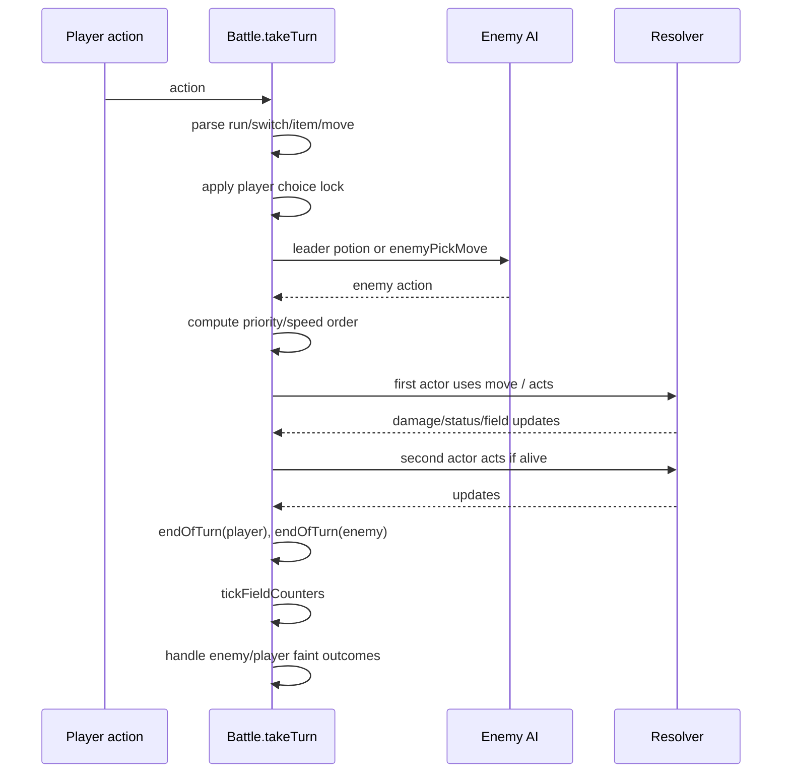

# Battle engine
Active contributors: Keigo

Purpose: document how `Battle` in `src/battle.ts` executes turn resolution, switching, catching, escape, and post-faint progression.

## Scope and related pages
- [Damage and type effectiveness](./damage-and-types.md)
- [Status and field effects](./status-and-field.md)
- [Abilities and held items](./abilities-and-items.md)
- [Trainer AI](./trainer-ai.md)
- [Move primitive](../../primitives/move.md)
- [Mockemon primitive](../../primitives/mockemon.md)
- [Data models](../../reference/data-models.md)
- [Catching feature](../../features/catching.md)

## Battle construction and state
`BattleKind` is:
- `{ kind: 'wild'; mon: Mockemon }`
- `{ kind: 'trainer'; trainer: TrainerDef }`

Constructor behavior in `src/battle.ts`:
1. Stores player party and enemy party based on `BattleKind`.
2. Sets `isTrainer`, `trainer`, and `enemyPotions` (`trainer.potions ?? 0`).
3. Picks first alive, non-egg player as `activeIndex`.
4. Calls `markParticipant()` for EXP tracking.
5. Fires `onSwitchIn('player')` and `onSwitchIn('enemy')` for lead abilities.

Each side has `SideState` from `freshSide()`:
- `stages` (`atk`, `def`, `spa`, `spd`, `spe`, `acc`, `eva`)
- `confusionTurns`, `flinched`, `leechSeed`
- `reflectTurns`, `lightScreenTurns`
- `spikes`, `stealthRock`
- `charging` (two-turn move lock)
- `choiceLock` (Power Band lock)
- `emberBoost` (from Ember Gut fire absorb)
- `aiSetupUsed` (smart/leader setup limiter)

Battle-level state includes `weather`, `terrain`, their turn counters, `participants` per enemy slot, `needsSwitch`, `runAttempts`, `outcome`, and `caughtMon`.

## Player actions
`PlayerAction` union:
- `{ type: 'move'; index: number }`
- `{ type: 'switch'; index: number }`
- `{ type: 'item'; item: 'potion' | 'superpotion' | 'mockball' }`
- `{ type: 'run' }`

## Turn flow in `takeTurn(action)`
High-level order:
1. Exit early if `outcome` is already set.
2. Clear both sides’ `flinched`.
3. Parse player action:
   - `run` -> `tryRun()`, may end turn immediately.
   - `switch` -> validate target, reset old side battle-only state, switch, apply entry hazards, `onSwitchIn`.
   - `item` -> `mockball` uses `tryCatch`; medicine heals active (`20` or `50`).
   - `move` -> resolve usable move, two-turn release lock, PP checks, fallback `struggle`.
4. Enforce player Power Band `choiceLock`.
5. Resolve enemy action:
   - if leader AI and low HP, may use `leaderUsePotion()` and skip move.
   - else pick move via `enemyPickMove()` and set enemy `choiceLock` when applicable.
6. Determine order by move priority, optional `swiftfeather` +1 priority proc (20%), then effective speed (50% coin flip on tie).
7. Execute actions in order (`playerAct`/`enemyAct`), with:
   - `canAct` gate (except release turn of two-turn charge),
   - PP decrement on charge-start turn only,
   - `useMove` resolution.
8. If no outcome, apply `endOfTurn` to player then enemy, then `tickFieldCounters`.
9. Post-turn faint checks (`handleEnemyFaint`, `handlePlayerFaint`).

## Switching and forced switches
Normal switch path in `takeTurn`:
- rejects invalid target (fainted, egg, same slot, missing index).
- resets outgoing side transient state (`stages`, confusion/flinch/seed, charge, lock, ember boost; clears old active toxic counter).
- applies hazards to entrant, then `onSwitchIn`.
- if hazard KO, immediately runs faint handling.

Forced switch path `forcedSwitch(index, msgs)`:
- same reset and hazard/on-entry pattern.
- clears `needsSwitch`.
- if hazard KO, resolves `handlePlayerFaint`.

## Catch mechanics (`tryCatch`)
Only in wild battles. Trainer battles always fail with message.

Core formula:
- `statusBonus = 2` for `SLP`/`FRZ`, `1.5` for other status, else `1`.
- `a = min(255, ((3*maxHp - 2*hp) * catchRate * statusBonus) / (3*maxHp))`
- `critCapture = chance(0.12)` (12%)
- checks = `1` if critical capture, else `4`
- `b = floor(65536 / (255 / max(1, a))^0.1875)`
- guaranteed catch if `a >= 255`; otherwise all checks must pass `randInt(0,65535) < b`.

Success sets:
- `caughtMon = enemy`
- `outcome = 'caught'`

Failure uses shake-text buckets by `a` (`>180`, `>100`, `>40`, else).

## Running (`tryRun`)
- Trainer battles cannot run.
- `runAttempts` increments each try.
- Escape succeeds if player effective speed >= foe effective speed, or random chance passes:
  - `chance(0.5 + runAttempts * 0.15)`
- Success sets `outcome = 'run'`.

## Fainting and progression
`handleEnemyFaint`:
- logs faint, calls `grantExp(enemyIndex)`.
- in trainer battles, sends next alive enemy, resets enemy transient side state, applies hazards and switch-in effects.
- if no enemy left, sets `outcome = 'win'` unless player also has no alive non-egg mons, then `lose`.

`handlePlayerFaint`:
- logs faint, applies friendship loss (`changeFriendship(..., -5)`).
- if no alive non-egg party member: `outcome = 'lose'` and blackout text.
- else sets `needsSwitch = true`.

### EXP and EV logic (`grantExp`)
- Base share per fainted enemy:
  - `share = floor((expYield * level) / 3 * (trainer ? 1.5 : 1))`, min `1`
- `participants` map controls full share recipients.
- Non-participants still get half share (`floor(share/2)`).
- `luckycharm` boosts recipient EXP by 50% (`floor(amount*1.5)`).
- Applies EV yield via `addEVs`.
- Applies EXP via `gainExp`, logs level up and learn-queue text.
- Triggers level/friendship evolution checks, then `evolve(...)`.
- Applies friendship gain (`changeFriendship(..., 1)`).

## Enemy move and potion selection summary
- `enemyPickMove()`:
  - respects ongoing two-turn charge.
  - falls back to `struggle` if no PP.
  - enforces enemy Power Band choice lock.
  - `basic` AI: heuristic weighted by type and power; status mostly when healthy.
  - `smart`/`leader` AI: `estimateDamage`, KO preference, setup/status heuristics, heal preference under 40%.
- `leaderUsePotion()`:
  - if enemy HP < 25% and potions remain, heal 50 HP and consume one potion.

## Key source files
| File | Role |
| --- | --- |
| `src/battle.ts` | Turn loop, action parsing, move resolution, catch/run/faint/EXP logic |
| `src/data/moves.ts` | Move schema and battle flags (priority, status, hazards, two-turn, recoil, drain) |
| `src/data/types.ts` | Type chart and `effectiveness()` |
| `src/data/abilities.ts` | Ability definitions and pinch mapping used in damage |
| `src/data/items.ts` | Held item metadata including type boosts and battle-relevant item IDs |
