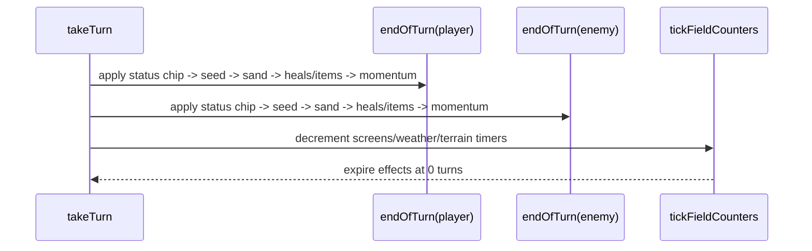

# Status and field effects
Active contributors: Keigo

Purpose: document status, volatile, hazard, weather, terrain, and end-of-turn processing in `src/battle.ts`.

## Related pages
- [Battle engine](./index.md)
- [Damage and type effectiveness](./damage-and-types.md)
- [Abilities and held items](./abilities-and-items.md)
- [Move primitive](../../primitives/move.md)
- [Mockemon primitive](../../primitives/mockemon.md)
- [Data models](../../reference/data-models.md)

## Non-volatile status conditions
Status IDs come from `src/data/moves.ts`: `PAR`, `BRN`, `PSN`, `TOX`, `SLP`, `FRZ`.

`applyStatus(move, target, msgs)` behavior:
- Ignores if move has no status effect or target is fainted.
- For damaging moves: applies by status chance.
- For status-category moves: treats status chance as guaranteed attempt.
- Fails if target already has a non-volatile status.
- For status moves, also fails if move type has `0` effectiveness on target.
- `SLP`: sets `sleepTurns = randInt(1, 3)`.
- `TOX`: resets `toxicCounter = 0`.

`canAct(...)` status effects:
- `SLP`: decrements `sleepTurns`; cannot act while still asleep; wakes when counter reaches zero.
- `FRZ`: 20% thaw chance per action check; otherwise cannot act.
- `PAR`: 25% full-paralysis chance; when triggered, cannot act.
- Speed penalty from paralysis is in `effectiveSpe`: `*0.5`.

End-of-turn damage (`endOfTurn`):
- `BRN`: `max(1, floor(maxHp/8))`
- `PSN`: `max(1, floor(maxHp/8))`
- `TOX`: increments `toxicCounter`, then `max(1, floor(maxHp * toxicCounter / 16))`
- Physical damage reduction from burn is handled in `damage()` (attack halved).

## Volatile effects
Stored in side state:
- `confusionTurns`
- `flinched`
- `leechSeed`

`applyVolatile(...)`:
- Confusion:
  - if already confused, status move reports already-confused text
  - else set `confusionTurns = randInt(2, 5)`
- Leech Seed:
  - fails on Grass-type targets
  - fails if already seeded
  - otherwise sets `leechSeed = true`

`canAct(...)` volatile gates:
- `flinched`: cannot act.
- Confusion:
  - decrements confusion turns
  - 50% self-hit chance
  - self-hit uses a fixed 40-power physical-style formula against own `atk/def`
  - self-hit blocks move execution

## Weather, terrain, screens, and hazards
`applyFieldEffects(move, userSide, msgs)` sets:
- Weather (`sun`, `rain`, `sand`) for `5` turns.
- Terrain (`electric`, `grassy`) for `5` turns.
- Screens on user side:
  - Reflect: `reflectTurns = 5`
  - Light Screen: `lightScreenTurns = 5`
- Hazards on opposing side:
  - Spikes: boolean layer (single layer)
  - Stealth Rock: boolean

## Hazards on switch-in
`applyHazards(side, msgs)` applies in this order:
1. Stealth Rock:
   - damage = `max(1, floor((maxHp/8) * effectiveness('Rock', defenderTypes)))`
2. Spikes:
   - only if grounded (`not Flying` and ability not `airborne`)
   - damage = `max(1, floor(maxHp/8))`

`airborne` grants both Ground move immunity and Spikes immunity through grounded check.

## End-of-turn sequence and field ticking
Per call to `takeTurn`, if no battle outcome:
1. `endOfTurn(active, 'player')`
2. `endOfTurn(enemy, 'enemy')`
3. `tickFieldCounters()`

Within each `endOfTurn(mon, side)`:
1. Burn/Poison/Toxic damage
2. Leech Seed drain and opponent heal
3. Sandstorm chip (`1/16`) for non-Rock/Ground
4. Grassy Terrain heal (`1/16`)
5. Leftovers heal (`1/16`)
6. Berry trigger at `hp <= floor(maxHp/2)`:
   - Oran Berry: +10 HP, consumed
   - Sitrus Berry: +25% max HP, consumed
7. Momentum ability: Speed stage +1 up to +6

`tickFieldCounters` then decrements:
- `reflectTurns` and `lightScreenTurns` per side; emits wear-off message at zero.
- `weatherTurns`; clears weather at zero with weather-specific message.
- `terrainTurns`; clears terrain at zero with terrain-faded message.

## Key source files
| File | Role |
| --- | --- |
| `src/battle.ts` | Status application, action gating, volatile flags, hazard application, end-of-turn and field timer flow |
| `src/data/moves.ts` | Status IDs and move flags for weather/terrain/screens/hazards/confusion/leech seed |
| `src/data/types.ts` | Stealth Rock scaling via `effectiveness('Rock', ...)` |
| `src/data/abilities.ts` | Ability IDs referenced by hazard immunity and momentum behavior |
| `src/data/items.ts` | End-of-turn held item triggers (berries, leftovers) |
