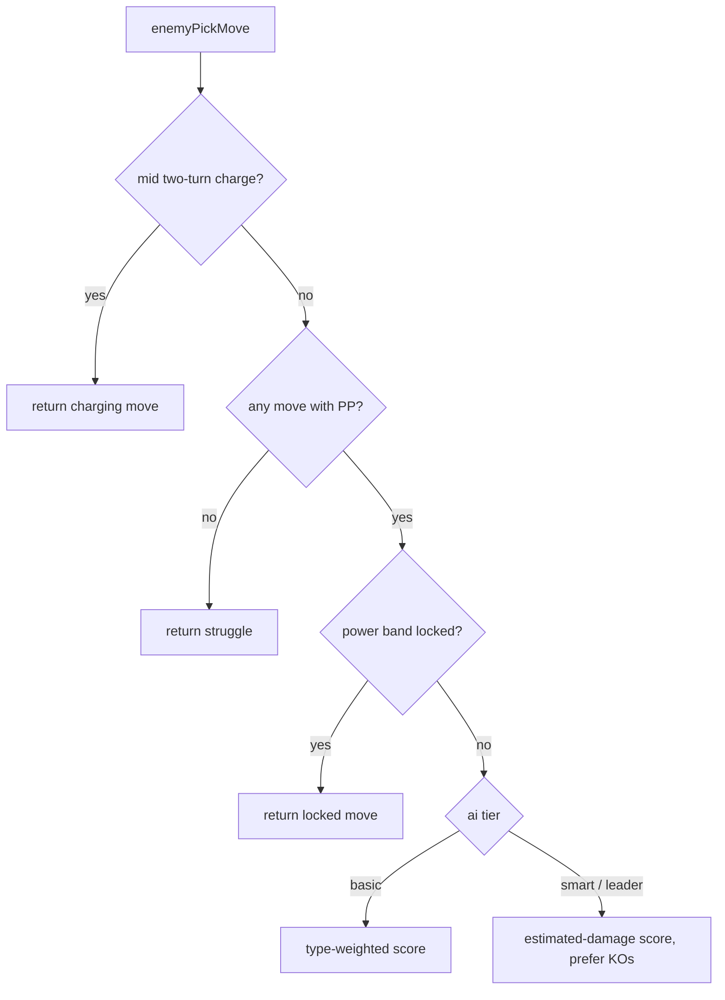
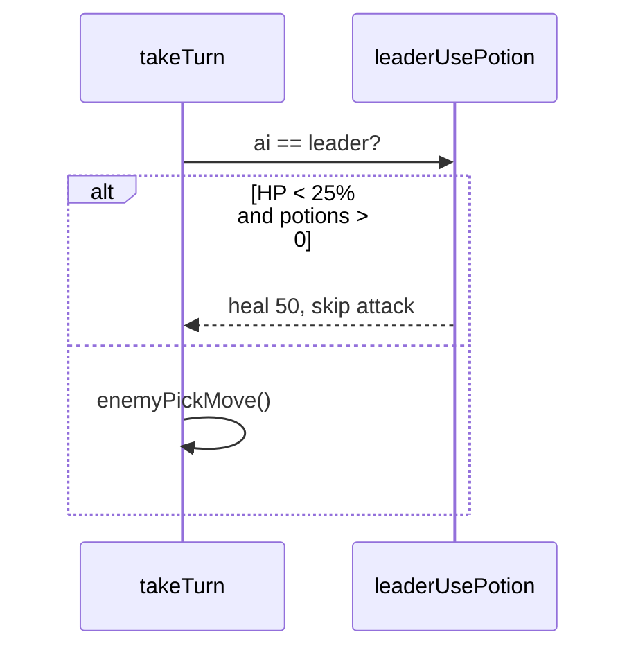

# Trainer AI

Active contributors: Keigo

## Purpose

Trainers choose their moves through `enemyPickMove()` in [`src/battle.ts`](../../reference/data-models.md). The method has three tiers of intelligence, selected by the `ai` field on a `TrainerDef`. Wild creatures and untagged trainers use the `basic` tier. This page explains how each tier scores moves and how gym leaders spend healing items.

## The three tiers

The tier comes from `this.trainer?.ai ?? 'basic'`. The `AiTier` type is `'basic' | 'smart' | 'leader'`. Tiers are assigned in [`src/maps.ts`](../../primitives/world-map.md): Gym Trainer Rocco is `smart`, Leader Terra is `leader` with one super potion, and everyone else defaults to `basic`.

Two guards run before any scoring. If the enemy is mid-charge on a two-turn move, that move is forced. If the enemy holds a Power Band, it is locked to its first chosen move (`choiceLock`). If it has no move with PP left, it uses Struggle.

## Basic tier

The `basic` tier scores each usable move and picks the highest, with a random jitter to avoid predictability.

- Status moves score 45 if the enemy is above 70% HP, otherwise 10. A status-inflicting move scores 0 when the player already has a status (it would be wasted).
- Damaging moves score `power * typeEffectiveness` against the player's active creature, multiplied by 1.5 for STAB.
- Every score is multiplied by a random factor of `0.85 + rand() * 0.3`.

This makes basic trainers favor strong, super-effective, same-type moves while occasionally opening with a status move at high HP.

## Smart and leader tiers

The `smart` and `leader` tiers share one scoring routine that estimates real damage and prefers knockouts.

- Damaging moves score their estimated damage from `estimateDamage()` (a simplified version of the real formula: level, power, atk/def, STAB, effectiveness, and a 0.925 average roll, ignoring crits, stages, and items). If the estimate would knock out the player, the score gains +100. A priority move that also knocks out gains a further +50.
- Status moves are used tactically: a status-inflicting move scores 30 when the player has no status and the enemy is above 50% HP; a screen scores 35 if no screen is up and the enemy is above 60%; a stat-change move scores 25 when above 60% HP and the setup has not been used this switch-in (`aiSetupUsed`), and only if the target stat is not already capped; a self-heal (`Mend`) scores 70 when the enemy is below 40% HP.
- Scores are jittered by `0.9 + rand() * 0.2`.

The `aiSetupUsed` flag limits smart trainers to one stat-boosting move per switch-in, preventing infinite setup loops. It is set in `takeTurn` whenever the chosen enemy move has a `statChange`, and reset when a fresh enemy creature enters.

`estimateDamage()` is a separate helper so the AI can rank options cheaply without running the full `damage()` pipeline (which has side effects and prints messages).

## Leader healing

Before picking a move, a `leader` trainer may spend a super potion. `leaderUsePotion()` fires when the enemy has potions left and its active creature is below 25% HP: it restores 50 HP, decrements `enemyPotions`, and consumes the turn (the enemy does not also attack). Leader Terra starts with one potion (`potions: 1` in `maps.ts`). If the potion is used, `enemyMoveId` stays null and the enemy skips its attack for the turn.

## Where the AI is invoked

`enemyPickMove()` is called from `takeTurn()` (see [Battle engine](index.md)) after the player action is parsed. The chosen move id feeds the same `useMove()` path the player uses, so trainer moves obey the identical damage, status, and field rules described in [Damage and type effectiveness](damage-and-types.md) and [Status and field effects](status-and-field.md). The headless [balance simulator](../../background/balance-simulation.md) drives real trainer parties through this AI to tune difficulty.

## Key source files

| File | Purpose |
|---|---|
| `src/battle.ts` | `enemyPickMove`, `estimateDamage`, `leaderUsePotion`, `AiTier`, `TrainerDef` |
| `src/maps.ts` | Per-trainer `ai` tier and `potions` assignments |
| `tools/simulate.ts` | Exercises trainer AI across many trials for balance |
