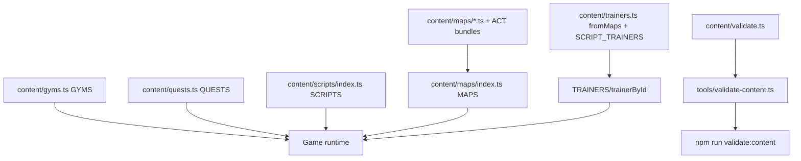

# Content pipeline
Active contributors: KeigoShimadaCC

## Purpose
Document how typed content in `src/content/` is authored, aggregated, validated, and consumed by the runtime.

## Directory layout
- `src/content/types.ts`: shared content types and tile constants.
- `src/content/maps/`: map modules and aggregator (`index.ts`).
- `src/content/gyms.ts`: gym metadata and badge level-cap helper.
- `src/content/trainers.ts`: trainer index aggregated from map NPCs plus scripted trainers.
- `src/content/encounters.ts`: encounter list modules used by maps.
- `src/content/quests.ts`: quest definitions.
- `src/content/scripts/index.ts`: script definitions.
- `src/content/validate.ts`: static validation checks.
- `tools/validate-content.ts`: CLI wrapper for `npm run validate:content`.

## Key abstractions
| Abstraction | Kind | Role |
| --- | --- | --- |
| `GameMap` and map primitives | Types in `src/content/types.ts` | Defines map topology, warps, NPCs, scripted events, and special tile systems. |
| `SOLID_TILES` | Constant in `src/content/types.ts` | Tile set treated as blocking terrain. |
| `SHALLOW_TILE` and `BADGE_FLAG_SHALLOW` | Constants in `src/content/types.ts` | `~` shallow-water gate keyed to Tide Badge flag. |
| `MAPS` | Constant in `src/content/maps/index.ts` | Aggregated map lookup consumed by the game runtime. |
| `GYMS` / `GYM_BY_LEADER` / `badgeCap` | Constants/functions in `src/content/gyms.ts` | League progression metadata and level caps. |
| `TRAINERS` / `trainerById` | Constants/function in `src/content/trainers.ts` | Unified trainer index for map trainers and script-only trainers. |
| `QUESTS` | Constant in `src/content/quests.ts` | Quest definitions and stage/journal data. |
| `SCRIPTS` | Constant in `src/content/scripts/index.ts` | Script programs used by NPCs and map events. |

## Content structure details
- `src/content/types.ts` defines: `GameMap`, `Warp`, `Gate`, `Button`, `OneWay`, `Pad`, `Npc`, `NpcTrainer`, `MapEvent`, `GroundItem`, `EncounterEntry`, plus `SOLID_TILES`, `SHALLOW_TILE` (`'~'`), and `BADGE_FLAG_SHALLOW`.
- `src/content/maps/` contains 53 `.ts` files total, including 7 base map modules (`mapletown`, `lab`, `route1`, `verdantcity`, `center`, `mart`, `gym`) and ACT2..ACT10 bundles merged in `src/content/maps/index.ts`.
- `src/content/gyms.ts` defines 8 `GymDef` entries, `GYM_BY_LEADER`, and `badgeCap(badgeCount)` (caps 14 through 50 by progression).
- `src/content/trainers.ts` builds `fromMaps` by scanning `MAPS`, merges `SCRIPT_TRAINERS`, exports `TRAINERS`, and serves lookups via `trainerById`.
- `src/content/encounters.ts` exports typed encounter lists (for example `route1Encounters`) that map modules import.
- `src/content/quests.ts` exports `QUESTS`.
- `src/content/scripts/index.ts` exports `SCRIPTS`.

## How it works
At runtime, `Game` imports content lookups directly (`MAPS`, `GYMS`, `QUESTS`, `SCRIPTS`, `trainerById`) and uses them for movement, script execution, quest state, battle setup, and progression (`src/game.ts`). `src/maps.ts` is now only a re-export shim that forwards `MAPS` and tile constants from content modules.

## Validation path
- `validateMaps()` in `src/content/validate.ts` checks map shape, coordinates, tile legality, warps, NPCs/trainers, scripted references, gate/button/pad consistency, wind and lava constraints, encounter tables, and reachability from `mapletown`.
- `tools/validate-content.ts` runs validation and exits non-zero when errors exist.
- Run with `npm run validate:content` (`package.json`).

## Integration points
- Engine import surface: `src/game.ts` imports `MAPS`, `GYMS`, `QUESTS`, `SCRIPTS`, and `trainerById`.
- Compatibility shim: `src/maps.ts` re-exports content-layer map and tile symbols for callers.
- Script and quest pages depend on this pipeline for authored content sources.

## Entry points for modification
- Add or edit map content in `src/content/maps/*.ts` and ensure it is included by bundle/index exports.
- Update league progression in `src/content/gyms.ts`.
- Add script-only opponents in `src/content/trainers.ts`.
- Add or tune quest and script content in `src/content/quests.ts` and `src/content/scripts/index.ts`.
- Run `npm run validate:content` after content edits.

## Integration references
- [World map](../primitives/world-map.md)
- [Scripting](scripting.md)
- [Quests](../features/quests.md)

## Key source files
| File | Role |
| --- | --- |
| `src/content/types.ts` | Content domain model and tile constants. |
| `src/content/maps/index.ts` | Aggregates all map modules into `MAPS`. |
| `src/content/gyms.ts` | Gym metadata, leader index, badge level caps. |
| `src/content/trainers.ts` | Trainer aggregation from maps plus script-only trainers. |
| `src/content/encounters.ts` | Encounter table modules consumed by map definitions. |
| `src/content/quests.ts` | Quest definition catalog. |
| `src/content/scripts/index.ts` | Script definition catalog. |
| `src/content/validate.ts` | Content integrity validation checks. |
| `tools/validate-content.ts` | CLI validator entrypoint used by npm script. |
| `src/game.ts` | Runtime consumer of aggregated content lookups. |
