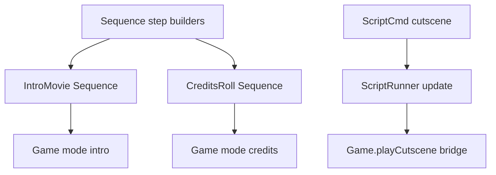

# Cutscenes and sequences
Active contributors: KeigoShimadaCC

## Purpose
Describe the frame-based sequence engine, the boot intro and credits overlays, and how scripts can trigger cutscenes.

## Directory layout
- `src/sequence.ts`: `Sequence` runtime, `SeqStep`, easing helpers, and composition utilities.
- `src/frontend.ts`: `IntroMovie`, `CreditsRoll`, and save-slot/title helpers.
- `src/game.ts`: intro and credits lifecycle plus `playCutscene` script bridge.
- `src/script.ts`: `cutscene` command in `ScriptCmd`.

## Key abstractions
| Abstraction | Kind | Role |
| --- | --- | --- |
| `Sequence` | Class in `src/sequence.ts` | Ticks a list of frame steps and tracks completion/progress. |
| `SeqStep` | Interface in `src/sequence.ts` | Frame step contract (`onStart`, `onFrame`, `onEnd`). |
| `EASE` | Constant in `src/sequence.ts` | Easing set: `linear`, `easeIn`, `easeOut`, `easeInOut`. |
| `Fader` | Class in `src/sequence.ts` | Draws a fullscreen alpha overlay for fade transitions. |
| `IntroMovie` | Class in `src/frontend.ts` | 5-scene boot movie shown before title when intro has not been marked seen. |
| `CreditsRoll` | Class in `src/frontend.ts` | Scrolling credits with starfield, cast text, and caught-species parade. |

## How it works
`Sequence.tick()` runs one frame at a time (`src/sequence.ts`), advancing current step state and moving to the next step when complete. Utilities build reusable steps:
- `tween`, `fade`, `pan`, `typeText`
- `parallel`
- `hold`, `call`, `waitUntil`
- `creditsScroll`

`IntroMovie` composes those steps into five scenes (`src/frontend.ts`):
1. Region pan.
2. The Ledger.
3. Team Rollback.
4. Originon at Null Peak.
5. Logo reveal.

`CreditsRoll` composes `creditsScroll(...).step` plus a hold and renders:
- Starfield background.
- Credits text list.
- Sprite parade of caught species.
- Player record stats (`badges`, `seen`, `caught`, `playtime`, party summary).

## Save-slot and intro flags in frontend
`src/frontend.ts` also owns persistence-facing title helpers:
- `SLOT_KEYS = ['pm_save', 'pm_save_2', 'pm_save_3']` (slot 1 keeps original `pm_save` key for compatibility).
- `INTRO_SEEN_KEY = 'pm_intro_seen'`.
- `readSlots()`, `newestSlot()`, `firstEmptySlot()`.
- `introSeen()`, `markIntroSeen()`.

`Game` uses these in title flow and intro flow (`src/game.ts`), while `main.ts` calls `introSeen()` before first boot movie (`src/main.ts`).

## Integration points
- Script bridge: `ScriptCmd` includes `cutscene`, and `ScriptRunner` calls `host.playCutscene(id, done)` (`src/script.ts`).
- Runtime host: `Game` implements `playCutscene` (`src/game.ts`), so scripts can suspend until cutscene completion.
- Mode integration: `Game.update()` updates `intro` and `credits` objects and `Game.render()` renders them (`src/game.ts`).

## Entry points for modification
- Add new sequence primitives in `src/sequence.ts`.
- Modify intro scenes or credits composition in `src/frontend.ts`.
- Expand script-driven cutscene behavior by implementing richer `Game.playCutscene` handling in `src/game.ts`.

## Integration references
- [Scripting](scripting.md)
- [Persistence](persistence.md)

## Key source files
| File | Role |
| --- | --- |
| `src/sequence.ts` | Generic frame-sequence runtime, easing, tween/fade/pan/type/parallel/wait utilities, fader, credit scroll step. |
| `src/frontend.ts` | Boot movie, credits roll, and slot/intro helper APIs. |
| `src/game.ts` | Intro/credits mode updates and render paths, plus `playCutscene` host method. |
| `src/script.ts` | `cutscene` command integration in script execution. |
| `src/main.ts` | Boot check for intro state and debug clear-save behavior through slot keys. |
