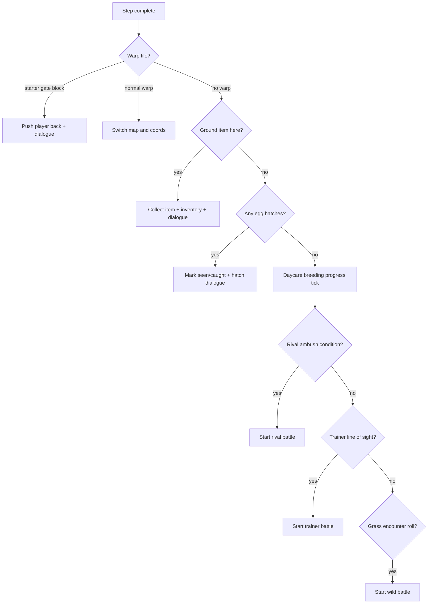

# Overworld
Active contributors: Keigo

## Purpose
Document overworld movement, blocking, interaction, step-triggered events, and related dialogue and menu state.

## Movement in `updateOverworld`
`Game.updateOverworld()` in `src/game.ts` handles movement in two phases:

1. **During tile-step animation (`moving === true`)**
   - Decrements `moveOffX` and `moveOffY` toward 0 at speed 4 px per tick.
   - When both reach 0, marks movement complete and calls `onStepComplete()`.

2. **When idle (`moving === false`)**
   - Reads one key from `consumePress()`.
   - If no queued press, falls back to held priority: `up`, `down`, `left`, `right` via `isHeld()`.
   - `a` triggers `interact()`.
   - `start` opens start menu.
   - Direction keys set `facing`, test `isBlocked(nx, ny)`, and if walkable:
     - move `px/py` to next tile
     - set `moveOffX/moveOffY` to `-dx * TILE` / `-dy * TILE`
     - set `moving = true`

## Blocking rules in `isBlocked`
`isBlocked(x, y)` checks:
- Tile solidity using `SOLID_TILES` from `src/maps.ts`.
- Exception: if tile is a warp door (`map.warps` contains that position), it is walkable.
- NPC occupancy: visible NPCs (`npcVisible`) block their tile.

## Step completion flow in `onStepComplete`
`onStepComplete()` runs checks in strict order:

Specific checks include:
- Warp transitions, including Maple Town to Route 1 starter gate lock before `starterChosen`.
- Ground item pickup from `map.items`.
- Party egg ticking (`tickEgg`).
- Daycare breeding step counter and egg generation every 256 valid steps.
- Rival ambush in lab after starter choice and before rival defeat.
- Trainer line-of-sight challenge via `inSight`.
- Wild encounters only on `G` grass tiles, with encounter rate roll and party viability checks.

## Line-of-sight in `inSight`
`inSight(npc)` traces forward from trainer facing direction up to `trainer.sight` tiles:
- Returns true if player is on one of those tiles.
- Stops early if a solid tile blocks vision.

## Interaction in `interact`
Interaction target order:
1. Adjacent visible NPC.
2. Talk-over-counter: if front tile is `C`, check one more tile beyond for NPC.
3. Adjacent sign (`map.signs`).
4. Adjacent locked door (`map.lockedDoors`).
5. Adjacent starter table tile `P` with context-sensitive starter text.

## NPC action dispatch in `talkTo`
`talkTo(npc)` routes by trainer status and `npc.action`:
- Trainer battle start if trainer exists and not yet defeated.
- `starter` -> starter selection dialogue and menu.
- `heal` -> center healing flow and heal point update.
- `shop` -> mart shop menu.
- `giveballs` -> one-time item grant using `gotBalls` flag.
- `gymleader` -> badge-dependent dialogue.
- `daycare` -> daycare dialogue and daycare menu stack.
- `trade` -> NPC trade flow.
- Default -> plain `npc.dialogue`.

## Dialogue and menu state
From `src/game.ts`:
- `showDialogue(lines, done?)` paginates lines and switches mode to `dialogue`.
- `MenuState` fields: `title`, `items`, `index`, `onSelect`, `onCancel`, optional `info`.
- `openMenu(m, push)` supports nested menus via `menuStack`.
- `closeMenu()` pops previous menu or returns to `overworld`.
- `closeAllMenus()` clears all menu state and returns to `overworld`.

## Overworld rendering
`renderOverworld()`:
- Computes camera centered on player with map-edge clamp.
- Draws visible tiles via `drawTile`.
- Draws uncollected ground items.
- Draws visible NPC sprites and trainer exclamation markers.
- Draws player sprite with facing-based flip.
- Draws location banner and clock panel.

Then `renderTint()` applies outdoor day/night overlay.

Related pages:
- [Story progression](../features/story-progression.md)
- [Day-night cycle](../features/day-night-cycle.md)
- [World map](../primitives/world-map.md)

## Key source files
| File | Role |
| --- | --- |
| `src/game.ts` | Overworld update logic, interactions, menus, and rendering. |
| `src/maps.ts` | Map topology, warps, NPCs, items, encounters, and `SOLID_TILES`. |
| `src/input.ts` | Press and held input APIs consumed by `updateOverworld()`. |
| `src/daynight.ts` | Time formatting and day phase used in overworld HUD and tinting. |
