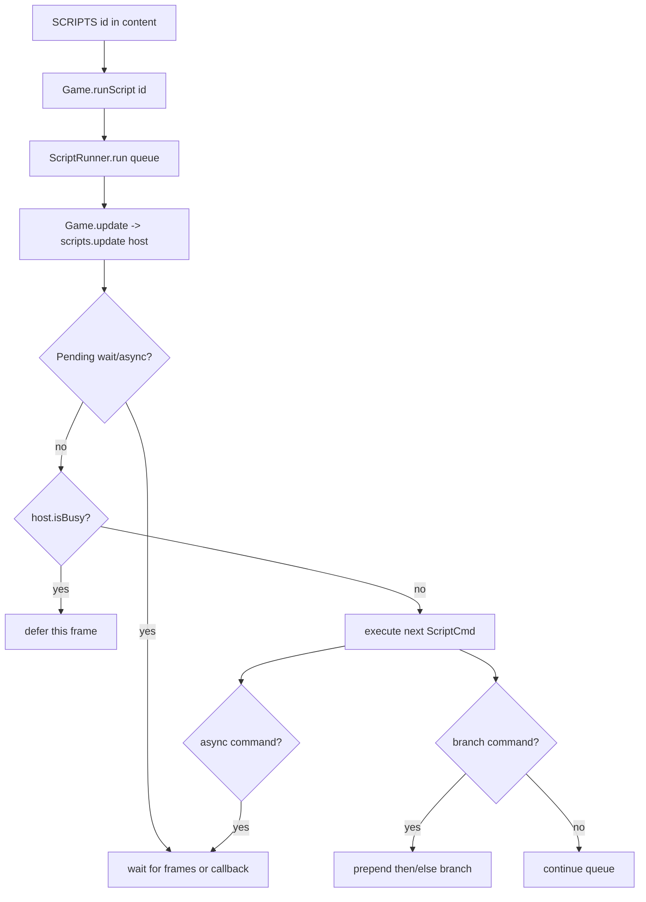

# Scripting
Active contributors: KeigoShimadaCC

## Purpose
Explain the script command language, the runtime that executes it, and where authored scripts are connected into the game.

## Directory layout
- `src/script.ts`: `ScriptCmd` tagged union, `ScriptHost` contract, and `ScriptRunner`.
- `src/game.ts`: `Game implements ScriptHost`, runs scripts, and triggers them from overworld events and NPC interaction.
- `src/content/scripts/index.ts`: authored `SCRIPTS` dictionary (`Record<string, ScriptCmd[]>`).
- `src/content/types.ts`: map-side script hooks (`Npc.script`, `MapEvent`, `GameMap.events`, `GameMap.onEnter`).

## Key abstractions
| Abstraction | Kind | Role |
| --- | --- | --- |
| `ScriptCmd` | Type union in `src/script.ts` | Declares all script commands the runner can execute. |
| `ScriptHost` | Interface in `src/script.ts` | Host API scripts call into (dialogue, battle, inventory, quests, warp, cutscene). |
| `ScriptRunner` | Class in `src/script.ts` | Queue executor with async and frame-wait support. |
| `SCRIPTS` | Data map in `src/content/scripts/index.ts` | Authored script programs keyed by script id. |

## Script commands
`ScriptCmd` in `src/script.ts` supports:
- Dialogue and branching: `say`, `choice`, `if`, `ifHasItem`, `ifQuest`.
- Flags and state: `setFlag`, `wait`, `call`.
- Inventory and roster: `giveItem`, `takeItem`, `giveMon`, `giveEgg`, `money`.
- Recovery and shops: `healParty`, `setHealPoint`, `shop`.
- Progression: `questStart`, `questAdvance`, `questComplete`.
- Flow and combat: `battle` (`onWin`/`onLose` branches), `warp`, `cutscene`.

## How it works
`Game.runScript(id)` loads `SCRIPTS[id]` and starts `this.scripts.run(cmds)` if no script is already running (`src/game.ts`). Each frame, `Game.update()` calls `this.scripts.update(this)` (`src/game.ts`), passing `Game` as the `ScriptHost`.

`ScriptRunner.update(host)` in `src/script.ts`:
1. Resolves pending waits (`{ kind: 'wait'; frames }`) and pending async tokens (`{ kind: 'async'; resolved }`).
2. Stops if `host.isBusy()` is true.
3. Shifts commands from `queue` and executes by command type.
4. For async commands (`say`, `choice`, `shop`, `battle`, `cutscene`), registers a callback and pauses until callback resolution.
5. For branch commands (`if`, `ifHasItem`, `ifQuest`, and `choice`/`battle` outcomes), prepends branch commands via `prepend`, so branch commands execute before the remaining queue.

## Integration points
- `Game implements ScriptHost` in `src/game.ts` and maps commands to engine behavior (`say`, `choose`, `startBattle`, `quest*`, `warp`, inventory updates, etc.).
- `cutscene` calls `host.playCutscene(id, done)` from `ScriptRunner` (`src/script.ts`) and is bridged in `Game.playCutscene` (`src/game.ts`).
- Content validation checks script references (`npc.script`, `events`, `onEnter`) against `SCRIPTS` (`src/content/validate.ts`).

## Trigger points
Scripts are triggered from:
- NPC interaction: `talkTo` runs `npc.script` first when present (`src/game.ts`, `src/content/types.ts`).
- Tile events: `onStepComplete` calls `fireEvent(this.map.events?.find(...))` (`src/game.ts`).
- Map enter events: after warp, `onStepComplete` calls `fireEvent(this.map.onEnter)` (`src/game.ts`).
- Debug API: `window.__PM.debug.runScript(id)` forwards to `game.runScript(id)` (`src/main.ts`).

## Entry points for modification
- Add or edit script content in `src/content/scripts/index.ts`.
- Add new command variants by extending `ScriptCmd` and the `switch` in `ScriptRunner.update` (`src/script.ts`).
- Expand engine-side command behavior by implementing new `ScriptHost` methods and `Game` implementations (`src/script.ts`, `src/game.ts`).
- Attach scripts to map data through `npc.script`, `events`, and `onEnter` in map files under `src/content/maps/` (`src/content/types.ts`).

## Integration references
- [Quests](../features/quests.md)
- [Content pipeline](content-pipeline.md)
- [Cutscenes and sequences](cutscenes.md)

## Key source files
| File | Role |
| --- | --- |
| `src/script.ts` | Script command types, host contract, queue executor, async/wait model, branch prepending. |
| `src/game.ts` | `ScriptHost` implementation, `runScript`, event triggers, NPC script dispatch, per-frame script update. |
| `src/content/scripts/index.ts` | Authored script programs. |
| `src/content/types.ts` | Map-side scripting fields (`script`, `events`, `onEnter`). |
| `src/content/validate.ts` | Script reference checks for maps and NPCs. |
